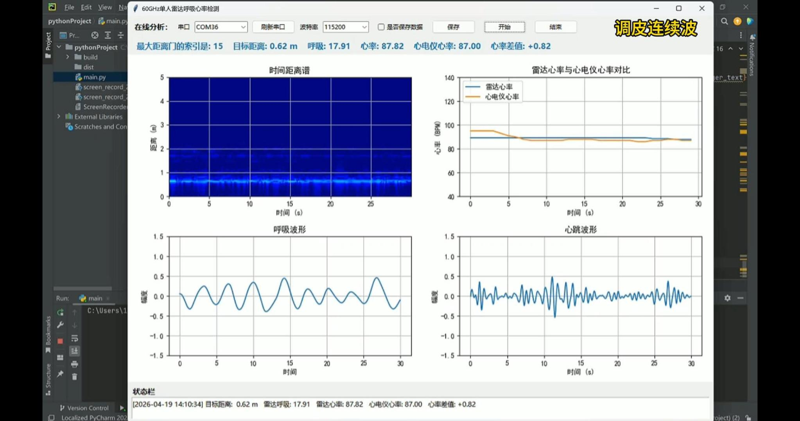

# 60GHz FMCW Radar Breath and Heart Detection

基于 60GHz FMCW 雷达的非接触式呼吸率与心率检测程序。

本项目主要面向单人近距离生命体征检测场景，通过三接收通道雷达数据采集、距离-角度定位、静态杂波抑制、目标相位提取、呼吸/心率频带分析，实现对人体胸腔微动的实时估计。程序同时支持指夹式心率/血氧仪数据读取，可用于与雷达估计结果进行对比验证。



## 1. 项目简介

毫米波 FMCW 雷达可以通过电磁波回波感知人体胸腔的微小周期运动。呼吸会引起毫米级胸腔起伏，心跳会引起更微弱、更高频的胸壁振动。对于 60GHz 雷达而言，目标微动会反映到回波相位变化中，因此可以通过相位解缠、滤波、频谱估计等方法提取呼吸率和心率。

本项目的核心处理流程为：

1. 通过串口读取三通道雷达原始 ADC 数据；
2. 对每帧数据进行 12bit 数据解码；
3. 构造三通道慢时间数据矩阵；
4. 对距离维进行 FFT，形成 Range-Time 数据；
5. 通过时间均值扣除实现静态杂波抑制；
6. 利用三通道 DBF 生成距离-角度谱，估计人体所在距离和角度；
7. 在目标距离/角度单元提取复数慢时间信号；
8. 对复数相位进行解缠、差分、异常点抑制和平滑；
9. 在呼吸频带和心率频带内估计主频；
10. 输出目标距离、角度、呼吸率、心率和信号质量指标。

## 2. 功能特性

- 支持 60GHz FMCW 雷达三接收通道数据解析；
- 支持单人目标距离估计；
- 支持三通道 DBF 距离-角度谱测角；
- 支持基于目标方向波束形成的胸腔微动相位提取；
- 支持呼吸率估计；
- 支持心率估计；
- 支持三通道心率候选融合与冗余校验；
- 支持静态杂波均值扣除；
- 支持异常相位跳变抑制；
- 支持 Tkinter 图形界面显示；
- 支持 Matplotlib 实时绘图；
- 支持串口自动刷新；
- 支持指夹心率/血氧仪 HID 读取；
- 支持原始三通道雷达数据保存为 `.mat` 文件，便于 MATLAB 后处理。

## 3. 适用场景

本项目适合用于：

- 60GHz FMCW 雷达生命体征算法学习；
- 非接触式呼吸检测实验；
- 非接触式心率检测实验；
- 三接收通道相位融合验证；
- 距离-角度谱目标定位实验；
- 雷达与指夹心率仪对比测试；
- MATLAB/Python 雷达数据处理流程复现；
- 毫米波雷达生命体征 GUI 原型开发。

本项目主要面向科研、学习和工程验证用途，不适合作为医疗诊断设备直接使用。

## 4. 硬件要求

建议硬件环境如下：

- 60GHz FMCW 雷达模块；
- 雷达支持 1T3R 或三接收通道输出；
- 雷达可通过串口输出原始帧数据；
- PC 端支持 Python 运行环境；
- 可选：USB HID 指夹心率/血氧仪，用于雷达心率结果对比。

当前程序中使用的主要雷达参数包括：

| 参数 | 默认值 |
|---|---|
| 雷达中心频率 | 60 GHz |
| 雷达带宽 | 4 GHz |
| ADC 采样率 | 1 MHz |
| Chirp 重复周期 | 300 us |
| 帧周期 | 50 ms |
| 每帧 chirp 数 | 256 |
| 接收通道数 | 3 |
| 默认目标距离范围 | 0.2 m 到 3.0 m |

如果使用不同型号雷达，需要根据实际雷达配置修改代码中的参数。

## 5. 软件环境

推荐使用：

- Python 3.9 或更高版本；
- Windows 10 / Windows 11；
- USB 串口驱动；
- 可选：HID 设备驱动。

依赖库包括：

```bash
pip install numpy scipy pyserial matplotlib hidapi
